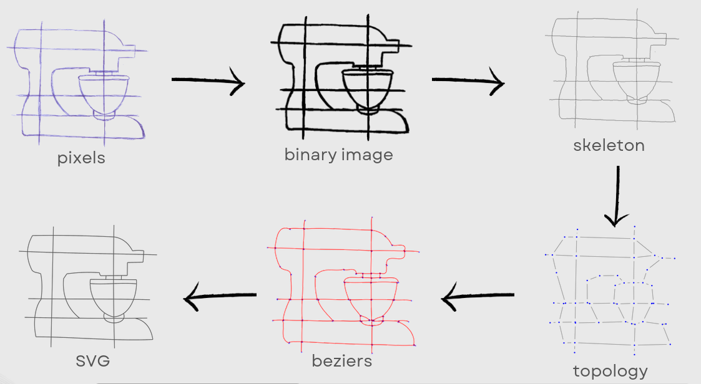

# sketch-vectorization



## Goal

The goal of this project is to implement the following paper: <https://www-sop.inria.fr/reves/Basilic/2016/FLB16/fidelity_simplicity.pdf>

We also implemented several new ideas, such as a [convolutional neural network](./notebooks/cnn.ipynb) with synthetic data augmentation for preprocessing.


## Demo

Guess what: the entire library can run in your browser !

If you want a guided tour of how the library works, go here:

[](https://marimo.app/github.com/rambip/sketch-vectorization/blob/main/notebooks/walkthrough.py)

If you just want to test it for yourself, with your own drawings, go here:

[](https://marimo.app/github.com/rambip/sketch-vectorization/blob/main/notebooks/app.py)

## Install

The library is also available as a pip package:

```
pip install "sketchy-svg[onnx]"
# or use uv: uv add "sketchy-svg[onnx]"
```

There is no command line interface. You can easily build your own, to get inspiration look at `src/sketchy_svg/viz` inside the class `Demo`


## Use locally

To install the dependencies, install [uv](https://github.com/astral-sh/uv) and run:

```bash
uv sync --extra onnx 
```

To launch the notebooks, run `uv run marimo edit .`, it should open the notebooks in your browser.

## Train the CNN

The CNN denoiser can be trained from `notebooks/cnn.py`.

**1. Install training dependencies**

On a machine with a GPU (Linux, default CUDA torch):
```bash
uv sync --group train
```

On a CPU-only machine (e.g. your local machine):
```bash
uv sync --group train --extra cpu
```

**2. Run the notebook**

```bash
uv run marimo edit notebooks/cnn.py
```

Set `USE_RAY = False` to train locally, or `USE_RAY = True` to offload to a remote [Ray](https://ray.io) cluster (set `RAY_ADDRESS` accordingly). The trained model is exported to `src/sketchy_cnn/model.onnx` at the end of the notebook.

<details>
<summary>How the SVG dataset is downloaded</summary>

`data/svg_dataset.csv` is tracked in git so no download is needed in most cases.

If you need to refresh it, the dataset comes from [OmniSVG/MMSVG-Icon](https://huggingface.co/datasets/OmniSVG/MMSVG-Icon) on HuggingFace. Create a token at <https://huggingface.co/settings/tokens> and add it to a `.env` file at the project root:

```
HF_TOKEN=hf_...
```

Then use the download button in `notebooks/svg_dataset.py`.

</details>

## Documentation

If you want, you can read the [Presentation](./documentaion/report.pdf)
